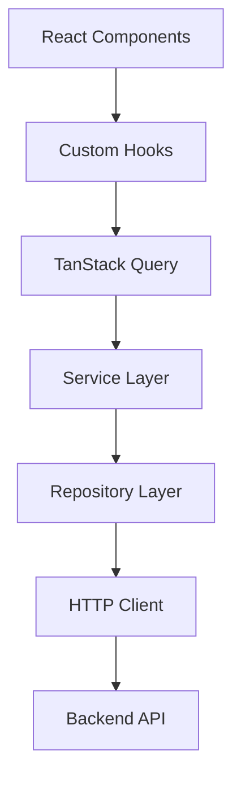

# API Integration

## Overview

The iCMS Admin Frontend implements a robust, scalable API layer that provides seamless integration with the backend services while maintaining clear separation of concerns and excellent developer experience.

## Architecture Overview

### API Layer Structure



### Layer Responsibilities

#### HTTP Client Layer
- **Request/Response Handling**: Axios-based HTTP client with interceptors
- **Authentication**: Automatic token management and refresh
- **Error Handling**: Global error processing and mapping
- **Base Configuration**: Centralized API configuration

#### Repository Layer
- **Data Access**: Direct API endpoint interactions
- **Request Formatting**: Standardized request/response handling
- **Error Mapping**: Convert API errors to domain errors
- **Type Safety**: Full TypeScript integration

#### Service Layer
- **Business Logic**: Domain-specific operations and validation
- **Data Transformation**: Format data for UI consumption
- **Caching Strategy**: Define caching behavior patterns
- **Error Handling**: Business-level error processing

#### Query Layer (TanStack Query)
- **State Management**: Server state caching and synchronization
- **Background Updates**: Automatic data refresh strategies
- **Optimistic Updates**: Immediate UI feedback patterns
- **Error Boundaries**: Centralized error handling

## Key Patterns & Signatures

### Base Repository Pattern
```typescript
abstract class BaseRepository {
  protected abstract baseUrl: string;
  
  protected async get<T>(endpoint: string): Promise<T>
  protected async post<T, U>(endpoint: string, data: U): Promise<T>
  protected async put<T, U>(endpoint: string, data: U): Promise<T>
  protected async delete<T>(endpoint: string): Promise<T>
  protected async getPaginated<T>(endpoint: string, params?: Record<string, unknown>): Promise<PaginatedResponse<T>>
}
```

### Service Layer Pattern
```typescript
interface ServiceLayer<T, CreateRequest, UpdateRequest> {
  getById(id: string): Promise<T>
  create(data: CreateRequest): Promise<T>
  update(id: string, data: UpdateRequest): Promise<T>
  delete(id: string): Promise<void>
  getList(filters: FilterParams): Promise<PaginatedResponse<T>>
}
```

### Query Key Structure
```typescript
const queryKeys = {
  [domain]: {
    all: [domain] as const,
    lists: () => [...queryKeys[domain].all, 'list'] as const,
    list: (filters: object) => [...queryKeys[domain].lists(), filters] as const,
    details: () => [...queryKeys[domain].all, 'detail'] as const,
    detail: (id: string) => [...queryKeys[domain].details(), id] as const,
  }
}
```

### Custom Hook Patterns
```typescript
// Query hooks signature
export const use[Domain]List = (filters: FilterParams) => useQuery({ ... })
export const use[Domain] = (id: string) => useQuery({ ... })

// Mutation hooks signature  
export const useCreate[Domain] = () => useMutation({ ... })
export const useUpdate[Domain] = () => useMutation({ ... })
export const useDelete[Domain] = () => useMutation({ ... })
```

## Error Handling Strategy

### Error Type Hierarchy
```typescript
export class ApiError extends Error {
  constructor(message: string, public code: string, public status?: number, public details?: unknown)
}

export class NetworkError extends Error { ... }
export class ValidationError extends Error { ... }
```

### Global Error Interceptor
- Automatic token refresh on 401 errors
- Rate limiting detection and handling
- Network error transformation
- Business error mapping

## Caching Strategy

### Cache Configuration Principles
- **Stale Time**: Domain-appropriate data freshness (1-5 minutes)
- **GC Time**: Memory management (5-10 minutes)
- **Retry Logic**: Smart retry with exponential backoff
- **Invalidation**: Strategic cache invalidation patterns

### Cache Invalidation Patterns
```typescript
// Optimistic updates
export const optimisticUpdate = <T>(queryClient: QueryClient, queryKey: unknown[], updater: (old: T) => T)

// Selective invalidation
export const invalidate[Domain]Cache = (queryClient: QueryClient) => {
  queryClient.invalidateQueries({ queryKey: queryKeys[domain].all })
}
```

## Testing Strategy

### API Testing Approach
- **Mock Service Worker**: API endpoint mocking
- **Repository Testing**: Unit tests for data access layer
- **Service Testing**: Business logic validation
- **Integration Testing**: End-to-end API flow testing

### Test Structure Signature
```typescript
describe('[Domain]Service', () => {
  beforeAll(() => server.listen())
  afterEach(() => server.resetHandlers())
  afterAll(() => server.close())

  test('should handle success scenarios', async () => { ... })
  test('should handle error scenarios', async () => { ... })
  test('should validate business rules', async () => { ... })
})
```

## Domain Organization

### File Structure Pattern
```
src/
├── repositories/
│   ├── base-repository.ts
│   ├── [domain]-repository.ts
│   └── index.ts
├── services/
│   ├── [domain]-service.ts
│   └── index.ts
├── hooks/
│   ├── queries/
│   │   ├── use-[domain]-queries.ts
│   │   └── index.ts
│   └── index.ts
└── types/
    ├── api.ts
    ├── [domain].ts
    └── index.ts
```

## Related Documentation

- [Authentication](../auth/README.md) - Authentication implementation patterns
- [State Management](../architecture/README.md) - State management integration
- [Error Handling](../development/README.md) - Error handling strategies
- [Testing](../testing/README.md) - API testing approaches 