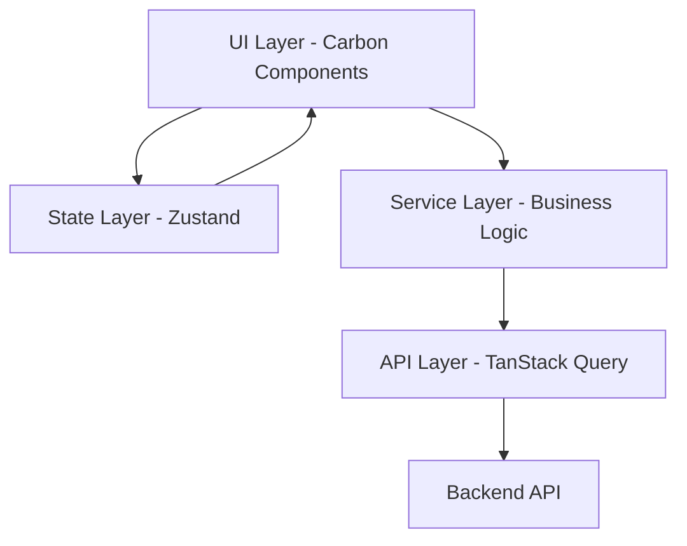

# Architecture & Design Patterns

## Overview

The iCMS Admin Frontend follows a domain-driven design approach with clear separation of concerns, ensuring scalability, maintainability, and testability through layered architecture and proven design patterns.

## System Architecture

### High-Level Architecture



### Layer Responsibilities

#### UI Layer
- **Components**: Presentational components using Carbon Design System
- **Pages**: Next.js page components and layouts
- **Styling**: CSS modules and Carbon theming
- **Interactions**: User events and UI state management

#### State Layer
- **Global State**: Application-wide state via Zustand stores
- **Local State**: Component-specific state via React hooks
- **Server State**: API data caching via TanStack Query
- **Persistence**: Client-side data persistence strategies

#### Service Layer
- **Business Logic**: Domain-specific operations and rules
- **Data Transformation**: API response formatting for UI
- **Validation**: Input validation and business rule enforcement
- **Orchestration**: Cross-domain operation coordination

#### API Layer
- **HTTP Client**: Axios-based HTTP client with interceptors
- **Query Management**: TanStack Query integration
- **Error Handling**: Centralized error processing
- **Caching**: Intelligent data caching strategies

## Domain-Driven Design

### Domain Structure Pattern
```
src/
├── domains/
│   ├── [domain-name]/
│   │   ├── components/     # UI components
│   │   ├── services/       # Business logic
│   │   ├── stores/         # State management
│   │   ├── types/          # Type definitions
│   │   ├── utils/          # Domain utilities
│   │   └── index.ts        # Domain exports
│   └── shared/             # Cross-domain utilities
└── app/                    # Next.js app structure
```

### Domain Guidelines

#### Domain Boundaries
- **Self-Contained**: Each domain manages its own concerns
- **Minimal Dependencies**: Limited cross-domain coupling
- **Clear Interfaces**: Well-defined domain boundaries
- **Shared Resources**: Common utilities in `/shared`

#### Naming Conventions
- **Domains**: kebab-case (`content-management`, `hr-management`)
- **Components**: PascalCase (`UserProfile`, `ContentEditor`)
- **Services**: camelCase with suffix (`userService`, `contentService`)
- **Types**: PascalCase (`User`, `ContentItem`)

## Design Patterns

### Component Architecture Patterns

#### Container/Presentation Pattern
```typescript
// Container: Logic and state management
interface ContainerProps {
  // Business logic props
}

const [Domain]Container: React.FC<ContainerProps> = (props) => {
  // Business logic, hooks, state management
  return <[Domain]Presentation {...presentationProps} />
}

// Presentation: Pure UI component
interface PresentationProps {
  // UI-specific props only
}

const [Domain]Presentation: React.FC<PresentationProps> = (props) => {
  // Pure UI logic, no business logic
}
```

#### Custom Hook Pattern
```typescript
// Business logic encapsulation
export const use[Domain]Logic = (params: LogicParams) => {
  // State management
  // API interactions
  // Business rules
  // Return interface for components
}

// Data fetching pattern
export const use[Domain]Data = (filters: FilterParams) => {
  // Query implementation
  // Error handling
  // Loading states
  // Return standardized data interface
}
```

### State Management Patterns

#### Zustand Store Pattern
```typescript
interface [Domain]State {
  // State properties
}

interface [Domain]Actions {
  // Action methods
}

export const use[Domain]Store = create<[Domain]State & [Domain]Actions>((set, get) => ({
  // State initialization
  // Action implementations
  // Computed values
}))
```

#### Server State Integration
```typescript
// Query key organization
export const [domain]Keys = {
  all: [domain] as const,
  lists: () => [...[domain]Keys.all, 'list'] as const,
  list: (filters: FilterParams) => [...[domain]Keys.lists(), filters] as const,
  details: () => [...[domain]Keys.all, 'detail'] as const,
  detail: (id: string) => [...[domain]Keys.details(), id] as const,
}

// Query hook patterns
export const use[Domain]List = (filters: FilterParams) => useQuery({ ... })
export const use[Domain]Detail = (id: string) => useQuery({ ... })
```

### Service Layer Patterns

#### Repository Pattern Signature
```typescript
interface Repository<T, CreateRequest, UpdateRequest> {
  getById(id: string): Promise<T>
  create(data: CreateRequest): Promise<T>
  update(id: string, data: UpdateRequest): Promise<T>
  delete(id: string): Promise<void>
  getList(filters: FilterParams): Promise<PaginatedResponse<T>>
}
```

#### Service Pattern Signature
```typescript
interface Service<T, CreateRequest, UpdateRequest> {
  // Business operations
  create(data: CreateRequest): Promise<T>
  update(id: string, data: UpdateRequest): Promise<T>
  delete(id: string): Promise<void>
  
  // Query operations
  getById(id: string): Promise<T>
  getList(filters: FilterParams): Promise<PaginatedResponse<T>>
  
  // Business logic
  validate(data: Partial<T>): ValidationResult
  transform(data: RawData): T
}
```

## Scalability Architecture

### File Organization Principles
- **Maximum Size**: 1000 lines per file
- **Single Responsibility**: One concern per file
- **Logical Grouping**: Related functionality together
- **Clear Exports**: Well-defined module interfaces

### Component Scaling Strategy
```typescript
// Large component breaking pattern
export const [Component]Container = () => {
  // Main orchestration logic
  return (
    <[Component]Layout>
      <[Component]Header {...headerProps} />
      <[Component]Content {...contentProps} />
      <[Component]Footer {...footerProps} />
    </[Component]Layout>
  )
}

// Sub-component pattern
export const [Component]Header = () => { /* Focused functionality */ }
export const [Component]Content = () => { /* Core content logic */ }
export const [Component]Footer = () => { /* Footer specific logic */ }
```

### Performance Optimization Patterns

#### Code Splitting Pattern
```typescript
// Route-based splitting
const [Domain]Page = lazy(() => import('@/domains/[domain]/pages/[Page]'))

// Component-based splitting  
const Heavy[Component] = lazy(() => import('@/components/[Component]'))

// Feature-based splitting
const [Feature] = lazy(() => import('@/domains/[domain]/features/[Feature]'))
```

#### Memoization Patterns
```typescript
// Component memoization
export const [Component] = React.memo<[Component]Props>((props) => {
  // Component implementation
})

// Value memoization
const expensiveValue = useMemo(() => {
  // Expensive calculation
}, [dependencies])

// Callback memoization
const handleAction = useCallback((params: ActionParams) => {
  // Action implementation
}, [dependencies])
```

## Error Handling Architecture

### Error Boundary Pattern
```typescript
interface ErrorBoundaryState {
  hasError: boolean
  error?: Error
}

class [Domain]ErrorBoundary extends Component<Props, ErrorBoundaryState> {
  // Error catching and recovery logic
  // Fallback UI rendering
  // Error reporting
}
```

### Global Error Handling
```typescript
// Error interceptor pattern
const errorInterceptor = (error: Error) => {
  // Error classification
  // User notification
  // Error logging
  // Recovery strategies
}

// Error recovery patterns
interface ErrorRecovery {
  retry(): void
  fallback(): void
  redirect(): void
}
```

## Security Architecture

### Authentication Guard Pattern
```typescript
const withAuth = <P extends object>(Component: ComponentType<P>) => {
  return (props: P) => {
    // Authentication verification
    // Role-based access control
    // Redirect logic
    return <Component {...props} />
  }
}
```

### Role-Based Access Pattern
```typescript
interface AccessControlProps {
  requiredRoles: UserRole[]
  children: ReactNode
  fallback?: ReactNode
}

const RequireAccess: React.FC<AccessControlProps> = ({ 
  requiredRoles, 
  children, 
  fallback 
}) => {
  // Permission checking logic
  // Conditional rendering
}
```

## Testing Architecture

### Test Organization Pattern
```
__tests__/
├── components/
│   ├── [domain]/
│   │   ├── [Component].test.tsx
│   │   └── __snapshots__/
│   └── shared/
├── services/
│   └── [domain]/
│       └── [service].test.ts
├── stores/
│   └── [domain]/
│       └── [store].test.ts
└── utils/
    └── test-helpers.ts
```

### Testing Pattern Signatures
```typescript
// Component testing pattern
describe('[Component]', () => {
  const renderComponent = (props = {}) => render(<Component {...defaultProps} {...props} />)
  
  test('should render correctly', () => { ... })
  test('should handle user interactions', () => { ... })
  test('should display error states', () => { ... })
})

// Service testing pattern  
describe('[Service]', () => {
  beforeEach(() => { /* Setup */ })
  afterEach(() => { /* Cleanup */ })
  
  test('should handle success scenarios', () => { ... })
  test('should handle error scenarios', () => { ... })
  test('should validate business rules', () => { ... })
})
```

## Related Documentation

- [API Integration](../api/README.md) - API layer patterns and integration
- [UI/UX Guidelines](../ui-ux/README.md) - Component design patterns
- [State Management](../development/README.md) - Detailed state patterns
- [Testing Strategy](../testing/README.md) - Testing implementation details 