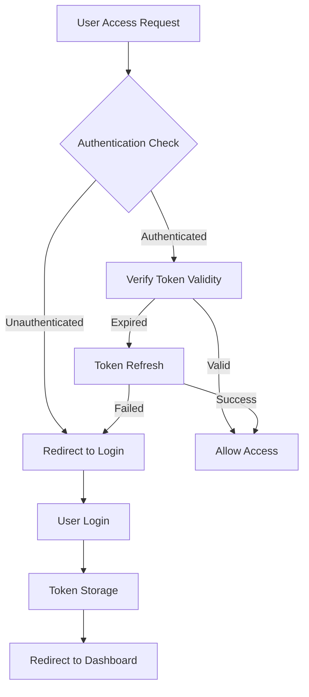

# Authentication & Authorization

## Overview

The iCMS admin frontend implements a secure authentication system that integrates with the backend API to provide role-based access control and session management with JWT token handling.

## Authentication Architecture

### Authentication Flow Pattern



### Core Authentication Components

#### Route Protection Strategy
- **Default Protection**: All routes protected by default
- **Automatic Redirect**: Unauthenticated users → `/login`
- **Token Validation**: Continuous token validity checking
- **Role-Based Access**: Permission-based route access

#### Token Management System
- **JWT Tokens**: Secure token-based authentication
- **Access/Refresh Pattern**: Short-lived access + long-lived refresh
- **Automatic Refresh**: Seamless token renewal
- **Secure Storage**: HttpOnly cookies for token storage

## API Integration Patterns

### Authentication Endpoints

#### Login Flow
```typescript
// Login endpoint signature
POST /api/v1/auth/login
Request: { email: string, password: string }
Response: {
  user: UserProfile,
  accessToken: string,
  refreshToken: string,
  expiresIn: string,
  tokenType: 'Bearer'
}
```

#### User Verification
```typescript
// User verification signature
GET /api/v1/auth/me
Headers: { Authorization: 'Bearer {accessToken}' }
Response: UserProfile
```

#### Token Refresh
```typescript
// Token refresh signature  
POST /api/v1/auth/refresh
Request: { refreshToken: string }
Response: {
  user: UserProfile,
  accessToken: string,
  refreshToken: string,
  expiresIn: string,
  tokenType: 'Bearer'
}
```

## Error Handling Patterns

### Authentication Error Types

#### Unauthorized Access (401)
```typescript
{
  success: false,
  error: {
    code: "UNAUTHORIZED_ERROR",
    message: "Unauthorized"
  }
}
```

#### Rate Limiting (429)
```typescript
{
  success: false,
  error: {
    code: "UNAUTHORIZED_ERROR", 
    message: "Too many failed attempts. Please try again later."
  }
}
```

### Error Recovery Strategies
- **Token Refresh**: Automatic retry with new token
- **Graceful Logout**: Clean session termination on critical errors
- **User Feedback**: Clear error messaging for user actions
- **Rate Limit Handling**: Appropriate delay and retry logic

## Security Implementation

### Token Security Features
- **JWT Validation**: Server-side token verification
- **Expiration Handling**: Automatic token lifecycle management
- **Refresh Rotation**: Security through token rotation
- **HttpOnly Storage**: XSS protection via secure cookie storage

### Session Management
- **Persistent Sessions**: Optional remember-me functionality
- **Session Expiry**: Configurable session timeout
- **Multi-tab Sync**: Cross-tab authentication state sync
- **Secure Logout**: Complete session cleanup

### Protection Mechanisms
- **CSRF Protection**: Cross-site request forgery prevention
- **XSS Protection**: Cross-site scripting mitigation
- **Rate Limiting**: Brute force attack prevention
- **Input Validation**: Server-side validation enforcement

## State Management Integration

### Authentication Store Pattern
```typescript
interface AuthState {
  user: User | null
  isAuthenticated: boolean
  loading: boolean
  error: string | null
}

interface AuthActions {
  login(credentials: LoginCredentials): Promise<void>
  logout(): Promise<void>
  refreshToken(): Promise<void>
  clearError(): void
}

export const useAuthStore = create<AuthState & AuthActions>()
```

### Persistence Strategy
- **State Hydration**: Restore authentication state on app load
- **Token Storage**: Secure client-side token management
- **Cross-Session**: Maintain state across browser sessions
- **Storage Cleanup**: Automatic cleanup on logout/expiry

## Route Protection Implementation

### Authentication Guards
```typescript
// Higher-order component pattern
const withAuth = <P extends object>(Component: ComponentType<P>) => {
  return (props: P) => {
    // Authentication verification logic
    // Redirect handling
    // Loading states
    return <Component {...props} />
  }
}
```

### Role-Based Access Control
```typescript
// Permission checking pattern
interface AccessControlProps {
  requiredRoles: UserRole[]
  children: ReactNode
  fallback?: ReactNode
}

const RequirePermission: React.FC<AccessControlProps> = ({
  requiredRoles,
  children,
  fallback
}) => {
  // Role verification logic
  // Conditional rendering
}
```

### Middleware Integration
```typescript
// Next.js middleware pattern
export function middleware(request: NextRequest) {
  // Token validation
  // Route protection logic
  // Redirection handling
}

export const config = {
  matcher: ['/dashboard/:path*', '/admin/:path*']
}
```

## Testing Strategy

### Authentication Testing Patterns
```typescript
// Mock authentication state
const createMockAuthState = (overrides = {}) => ({
  user: mockUser,
  isAuthenticated: true,
  ...overrides
})

// Test authentication flows
describe('Authentication Flow', () => {
  test('should redirect unauthenticated users', () => { ... })
  test('should handle token refresh', () => { ... })
  test('should cleanup on logout', () => { ... })
})
```

### API Mocking Strategy
```typescript
// MSW authentication handlers
const authHandlers = [
  rest.post('/api/v1/auth/login', loginHandler),
  rest.get('/api/v1/auth/me', getMeHandler),
  rest.post('/api/v1/auth/refresh', refreshHandler),
]
```

## Integration Points

### Component Integration
- **Login Forms**: Authentication UI components
- **Protected Routes**: Route-level protection
- **User Profile**: User information display
- **Navigation Guards**: Menu item access control

### Service Integration
- **API Client**: Automatic token attachment
- **Error Handling**: Global authentication error processing
- **State Sync**: Cross-component state synchronization
- **Persistence**: Local storage integration

## Related Documentation

- [API Integration](../api/README.md) - API client authentication setup
- [Architecture](../architecture/README.md) - Overall system architecture
- [Security Guidelines](../development/README.md) - Security best practices
- [Testing Strategy](../testing/README.md) - Authentication testing approaches 