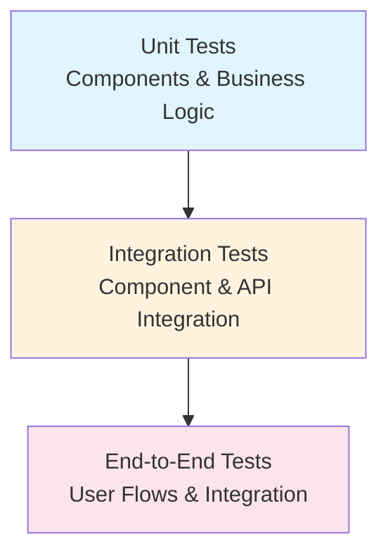

# Testing Strategy

## Overview

The iCMS Admin Frontend implements a comprehensive testing strategy ensuring 100% reliability through multiple testing layers, from unit tests to end-to-end testing, all designed to maintain the highest quality standards for government-grade applications.

## Testing Philosophy

### Quality Standards
- **100% Test Coverage**: All components and business logic must be tested
- **Test-Driven Development**: Write tests before implementation where possible
- **Behavior-Driven**: Focus on testing behavior, not implementation details
- **Accessibility Testing**: Ensure compliance with WCAG 2.1 AA standards

### Testing Pyramid Strategy



## Testing Stack Architecture

### Core Testing Technologies
- **Jest**: Unit testing framework and test runner
- **React Testing Library**: Component testing with user-centric approach
- **Playwright**: End-to-end testing with multi-browser support
- **MSW (Mock Service Worker)**: API mocking and service virtualization
- **Storybook**: Component documentation and visual testing

### Testing Utilities
- **@testing-library/jest-dom**: Custom Jest matchers for DOM testing
- **@testing-library/user-event**: User interaction simulation
- **jest-axe**: Accessibility testing integration
- **jest-environment-jsdom**: DOM environment for Jest

## Unit Testing Strategy

### Component Testing Standards

#### Component Test Structure
```typescript
// Standard component test pattern
describe('ComponentName', () => {
  const renderComponent = (props = {}) => render(
    <TestProviders>
      <ComponentName {...defaultProps} {...props} />
    </TestProviders>
  )

  beforeEach(() => {
    // Setup logic
  })

  test('should render correctly', () => { /* Implementation */ })
  test('should handle user interactions', () => { /* Implementation */ })
  test('should display error states', () => { /* Implementation */ })
  test('should be accessible', () => { /* Implementation */ })
})
```

#### Testing Patterns
- **Rendering Tests**: Verify component renders without errors
- **Interaction Tests**: Test user interactions and event handling
- **State Tests**: Validate state changes and updates
- **Accessibility Tests**: Ensure WCAG compliance
- **Error Boundary Tests**: Test error handling scenarios

### Service Layer Testing

#### Business Logic Testing
```typescript
// Service testing pattern
describe('ServiceName', () => {
  beforeAll(() => server.listen())
  afterEach(() => server.resetHandlers())
  afterAll(() => server.close())

  test('should handle success scenarios', () => { /* Implementation */ })
  test('should handle error scenarios', () => { /* Implementation */ })
  test('should validate business rules', () => { /* Implementation */ })
  test('should transform data correctly', () => { /* Implementation */ })
})
```

#### State Management Testing
```typescript
// Store testing pattern
describe('StoreName', () => {
  test('should initialize with correct default state', () => { /* Implementation */ })
  test('should update state on actions', () => { /* Implementation */ })
  test('should persist state correctly', () => { /* Implementation */ })
  test('should handle async actions', () => { /* Implementation */ })
})
```

## Integration Testing

### Component Integration Strategy
- **Multi-Component**: Testing component interaction and communication
- **API Integration**: Testing component behavior with real API responses
- **State Integration**: Testing component integration with global state
- **Route Integration**: Testing navigation and routing behavior

### API Integration Testing
```typescript
// API integration test pattern
describe('API Integration', () => {
  test('should handle successful API responses', () => { /* Implementation */ })
  test('should handle API errors gracefully', () => { /* Implementation */ })
  test('should cache responses correctly', () => { /* Implementation */ })
  test('should retry failed requests', () => { /* Implementation */ })
})
```

## End-to-End Testing

### E2E Testing Strategy
- **Critical User Flows**: Authentication, core business processes
- **Cross-Browser Testing**: Chrome, Firefox, Safari, Edge
- **Mobile Testing**: Responsive design validation
- **Performance Testing**: Load time and interaction responsiveness

### E2E Test Structure
```typescript
// E2E test pattern
test.describe('User Authentication Flow', () => {
  test('should allow user to login successfully', async ({ page }) => {
    // Test implementation
  })

  test('should handle login errors', async ({ page }) => {
    // Test implementation  
  })

  test('should redirect after successful login', async ({ page }) => {
    // Test implementation
  })
})
```

## Accessibility Testing

### A11y Testing Strategy
- **Automated Testing**: jest-axe integration for basic compliance
- **Manual Testing**: Screen reader and keyboard navigation testing
- **Color Contrast**: Automated contrast ratio validation
- **Focus Management**: Tab order and focus indicator testing

### Accessibility Test Patterns
```typescript
// Accessibility testing pattern
test('should be accessible', async () => {
  const { container } = renderComponent()
  const results = await axe(container)
  expect(results).toHaveNoViolations()
})

test('should support keyboard navigation', async () => {
  // Keyboard navigation test implementation
})
```

## Visual Testing

### Visual Regression Strategy
- **Component Screenshots**: Automated screenshot comparison
- **Cross-Browser Visual**: Multi-browser visual consistency
- **Responsive Visual**: Different viewport size testing
- **Theme Testing**: Light/dark theme visual validation

### Storybook Integration
```typescript
// Storybook story with testing
export const Default: Story = {
  args: {
    // Component props
  },
  play: async ({ canvasElement }) => {
    // Interaction testing within Storybook
  }
}
```

## Performance Testing

### Performance Testing Strategy
- **Load Time Testing**: Component and page load performance
- **Memory Usage**: Memory leak detection and optimization
- **Bundle Size**: Bundle size impact assessment
- **Interaction Performance**: User interaction responsiveness

### Performance Test Patterns
```typescript
// Performance testing pattern
test('should load within acceptable time', async () => {
  const startTime = performance.now()
  renderComponent()
  const endTime = performance.now()
  expect(endTime - startTime).toBeLessThan(100) // 100ms threshold
})
```

## Test Data Management

### Mock Data Strategy
- **Realistic Data**: Production-like test data
- **Edge Cases**: Boundary and error condition data
- **Internationalization**: Multi-language test data
- **Dynamic Generation**: Programmatic test data creation

### Mock Service Worker Setup
```typescript
// MSW handlers pattern
export const handlers = [
  rest.get('/api/endpoint', (req, res, ctx) => {
    // Mock response logic
  }),
  rest.post('/api/endpoint', (req, res, ctx) => {
    // Mock response logic
  })
]
```

## Test Environment Configuration

### Test Environment Setup
- **Jest Configuration**: Optimized Jest settings for project
- **Test Utilities**: Shared testing utilities and helpers
- **Provider Setup**: Test provider configuration
- **Environment Variables**: Test-specific environment configuration

### CI/CD Integration
- **Automated Testing**: Tests run on every commit and PR
- **Parallel Execution**: Tests run in parallel for speed
- **Test Reporting**: Comprehensive test result reporting
- **Coverage Reporting**: Code coverage tracking and enforcement

## Testing Best Practices

### Test Organization
```
__tests__/
├── components/
│   ├── [domain]/
│   │   ├── Component.test.tsx
│   │   └── __snapshots__/
│   └── shared/
├── services/
│   └── [domain]/
│       └── service.test.ts
├── stores/
│   └── [domain]/
│       └── store.test.ts
├── utils/
│   ├── test-helpers.ts
│   └── test-utils.tsx
└── e2e/
    └── user-flows/
```

### Test Naming Conventions
- **Descriptive Names**: Clear, behavior-focused test names
- **Consistent Structure**: Standardized test organization
- **Domain Grouping**: Tests organized by domain/feature
- **File Naming**: Consistent test file naming patterns

## Quality Gates

### Test Coverage Requirements
- **Component Coverage**: 100% line and branch coverage
- **Service Coverage**: 100% business logic coverage
- **Integration Coverage**: All critical user paths tested
- **E2E Coverage**: All primary user flows validated

### Performance Benchmarks
- **Unit Test Speed**: < 10ms per test average
- **Integration Test Speed**: < 100ms per test average
- **E2E Test Speed**: < 5 seconds per test average
- **Total Test Suite**: < 5 minutes for complete run

## Debugging and Troubleshooting

### Test Debugging Strategies
- **Debug Mode**: Running tests in debug mode for investigation
- **Test Isolation**: Running individual tests for focused debugging
- **Mock Debugging**: Verifying mock behavior and responses
- **Error Analysis**: Systematic error investigation process

### Common Testing Patterns
- **Act-Arrange-Assert**: Standard test structure pattern
- **Given-When-Then**: BDD-style test organization
- **Setup-Exercise-Verify**: Alternative test structure
- **Teardown**: Proper test cleanup and isolation

## Continuous Improvement

### Test Metrics Monitoring
- **Test Execution Time**: Monitor and optimize test performance
- **Test Reliability**: Track flaky tests and failure rates
- **Coverage Trends**: Monitor coverage changes over time
- **Test Maintenance**: Regular test suite maintenance and updates

### Testing Tool Evolution
- **Tool Updates**: Regular testing framework updates
- **New Testing Patterns**: Adoption of improved testing practices
- **Performance Optimization**: Continuous test suite optimization
- **Tooling Integration**: Enhanced CI/CD and tooling integration

## Related Documentation

- [Development Guidelines](../development/README.md) - Development standards and practices
- [Component Guidelines](../ui-ux/README.md) - Component development and testing
- [API Testing](../api/README.md) - API layer testing strategies
- [Architecture](../architecture/README.md) - System architecture testing considerations 