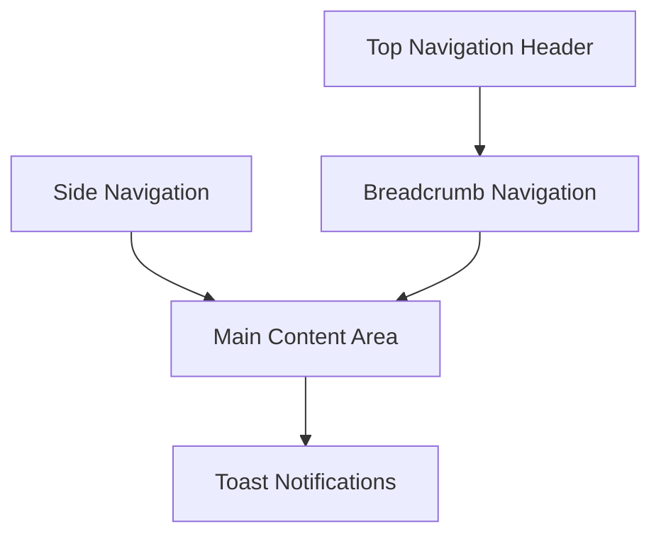

# UI/UX Guidelines

## Overview

The iCMS Admin Frontend follows IBM Carbon Design System principles to deliver a consistent, accessible, and professional government-grade user interface with scalable design patterns.

## Design Philosophy

### Carbon Design Principles
- **Clear**: Eliminate ambiguity and enable users to see, understand, and act with confidence
- **Efficient**: Design for the quickest, smartest path to help users achieve their goals
- **Consistent**: Create familiarity and strengthen intuition by applying the same solution to the same problem
- **Delightful**: Use thoughtful details and motion to create positive moments

### Government Standards
- **Accessibility**: WCAG 2.1 AA compliance mandatory
- **Professional**: Clean, minimal design appropriate for government use
- **Inclusive**: Design for all users regardless of ability or technology
- **Trustworthy**: Consistent and reliable user experience

## Dashboard Layout Architecture

### Standard Dashboard Structure



### Layout Component Patterns

#### Top Navigation Structure
- **System Branding**: iCMS logo and system name
- **User Profile**: User information and logout functionality
- **Language Switcher**: Nepali/English toggle
- **Notifications**: System notifications management
- **Global Search**: System-wide search functionality

```typescript
// Top navigation component signature
interface TopNavigationProps {
  user: User
  notifications: Notification[]
  onLanguageChange: (locale: string) => void
  onSearch: (query: string) => void
  onLogout: () => void
}

const TopNavigation: React.FC<TopNavigationProps>
```

#### Side Navigation Pattern
- **Primary Navigation**: Main system modules
- **Collapsible Design**: Space-saving responsive behavior
- **Role-Based Access**: Permission-driven menu items
- **Active State Indication**: Clear current page highlighting

```typescript
// Side navigation component signature
interface SideNavigationProps {
  user: User
  menuItems: MenuItem[]
  collapsed: boolean
  onMenuItemClick: (item: MenuItem) => void
  onToggleCollapse: () => void
}

const SideNavigation: React.FC<SideNavigationProps>
```

#### Breadcrumb Navigation System
- **Dynamic Path**: Real-time route reflection
- **Clickable Links**: Easy parent navigation
- **Internationalized**: Multi-language support
- **Context Awareness**: Domain-specific breadcrumbs

```typescript
// Breadcrumb component signature
interface BreadcrumbProps {
  items: BreadcrumbItem[]
  onItemClick: (item: BreadcrumbItem) => void
}

interface BreadcrumbItem {
  label: string
  href: string
  isCurrentPage: boolean
}

const BreadcrumbNav: React.FC<BreadcrumbProps>
```

### Content Layout Patterns

#### Page Layout Structure
- **Consistent Spacing**: 16px base spacing unit system
- **Content Hierarchy**: Clear visual hierarchy patterns
- **Responsive Design**: Multi-device adaptation
- **Loading States**: Skeleton loader implementations

```typescript
// Page layout component signature
interface PageLayoutProps {
  title: string
  subtitle?: string
  actions?: React.ReactNode
  breadcrumbs?: BreadcrumbItem[]
  children: React.ReactNode
  loading?: boolean
}

const PageLayout: React.FC<PageLayoutProps>
```

## Component Design Patterns

### Form Component Architecture

#### Form Layout Principles
- **Logical Grouping**: Related fields organized together
- **Progressive Disclosure**: Advanced options revealed on demand
- **Real-time Validation**: Immediate feedback on input
- **Accessibility**: Full ARIA attribute implementation

```typescript
// Form group component signature
interface FormGroupProps {
  title: string
  description?: string
  children: React.ReactNode
  error?: string
  collapsible?: boolean
}

const FormGroup: React.FC<FormGroupProps>
```

#### Input Component Standards
- **Consistent Styling**: Carbon design system compliance
- **Validation States**: Success, warning, error visual states
- **Help Text Integration**: Contextual guidance display
- **Required Field Indicators**: Clear requirement marking

```typescript
// Form field component signature
interface FormFieldProps {
  label: string
  helperText?: string
  required?: boolean
  error?: string
  success?: boolean
  children: React.ReactNode
}

const FormField: React.FC<FormFieldProps>
```

### Data Display Patterns

#### Data Table Architecture
- **Responsive Design**: Adaptive table layouts
- **Sorting Capabilities**: Column-based data sorting
- **Filtering System**: Advanced search and filter
- **Pagination Management**: Large dataset handling

```typescript
// Data table component signature
interface DataTableProps<T> {
  data: T[]
  columns: TableColumn<T>[]
  loading?: boolean
  pagination?: PaginationConfig
  sorting?: SortingConfig
  filtering?: FilterConfig
  onSort?: (column: string, direction: SortDirection) => void
  onFilter?: (filters: FilterParams) => void
}

const DataTable: React.FC<DataTableProps<T>>
```

#### Card Component System
- **Information Hierarchy**: Structured content organization
- **Action Integration**: Consistent action placement
- **Status Indication**: Visual status representation
- **Loading State Support**: Skeleton loading patterns

```typescript
// Card component signature
interface CardProps {
  title: string
  subtitle?: string
  content: React.ReactNode
  actions?: React.ReactNode
  status?: 'success' | 'warning' | 'error' | 'info'
  loading?: boolean
  variant?: 'default' | 'outlined' | 'elevated'
}

const InfoCard: React.FC<CardProps>
```

## Notification System Architecture

### Toast Notification Pattern
- **Contextual Messaging**: Success, warning, error, info types
- **Auto-dismiss Logic**: Configurable timeout behavior
- **Action Support**: Optional action button integration
- **Queue Management**: Multiple notification handling

```typescript
// Toast notification system signature
interface NotificationState {
  notifications: Notification[]
  showNotification: (notification: NotificationConfig) => void
  removeNotification: (id: string) => void
  clearAll: () => void
}

interface NotificationConfig {
  type: 'success' | 'warning' | 'error' | 'info'
  title: string
  message: string
  timeout?: number
  actions?: NotificationAction[]
}

const ToastManager: React.FC
```

### Modal Dialog System
- **Focus Management**: Proper accessibility focus handling
- **Keyboard Navigation**: Full keyboard accessibility
- **Confirmation Patterns**: Standardized confirmation dialogs
- **Loading State Integration**: Modal loading indicators

```typescript
// Modal component signature
interface ModalProps {
  open: boolean
  title: string
  children: React.ReactNode
  actions?: ModalAction[]
  onClose: () => void
  size?: 'small' | 'medium' | 'large'
  preventClose?: boolean
}

interface ConfirmationModalProps {
  open: boolean
  title: string
  message: string
  confirmText: string
  cancelText: string
  onConfirm: () => void
  onCancel: () => void
  dangerous?: boolean
}

const Modal: React.FC<ModalProps>
const ConfirmationModal: React.FC<ConfirmationModalProps>
```

## Accessibility Architecture

### Keyboard Navigation Standards
- **Tab Order**: Logical sequential navigation
- **Skip Links**: Direct content access
- **Focus Indicators**: Clear visual focus states
- **Keyboard Shortcuts**: Consistent shortcut patterns

### Screen Reader Support
- **ARIA Labels**: Comprehensive labeling strategy
- **Landmark Roles**: Clear page structure definition
- **Live Regions**: Dynamic content announcements
- **Alternative Text**: Complete image and icon descriptions

### Color and Contrast Compliance
- **WCAG AA Standards**: Minimum 4.5:1 contrast ratio
- **Color Independence**: Information beyond color alone
- **High Contrast Support**: Enhanced visibility modes
- **Dark Mode Integration**: Optional dark theme support

## Responsive Design System

### Breakpoint Strategy
```css
/* Mobile-First Responsive Framework */
.responsive-container {
  /* Mobile: 320px+ */
  padding: 1rem;
  
  /* Tablet: 768px+ */
  @media (min-width: 768px) {
    padding: 1.5rem;
  }
  
  /* Desktop: 1024px+ */
  @media (min-width: 1024px) {
    padding: 2rem;
  }
  
  /* Large Desktop: 1440px+ */
  @media (min-width: 1440px) {
    padding: 3rem;
  }
}
```

### Grid System Integration
- **Carbon Grid**: IBM Carbon grid system utilization
- **Flexbox Layout**: Modern flexible layout techniques
- **Container Queries**: Component-based responsive design
- **Content Reflow**: Graceful content reorganization

## Performance Design Patterns

### Loading State Architecture
- **Skeleton Loaders**: Structure-preserving loading states
- **Progressive Loading**: Priority-based content loading
- **Lazy Loading**: On-demand resource loading
- **Loading Indicators**: Clear loading feedback systems

### Animation and Motion System
- **Purposeful Motion**: Functional animation design
- **Performance Optimization**: GPU-accelerated animations
- **Reduced Motion Support**: User preference respect
- **Duration Standards**: Consistent timing patterns

```css
/* Motion Design System */
.animation-slide-in {
  transition: transform 200ms ease-out;
}

.animation-fade-in {
  transition: opacity 150ms ease-in;
}

/* Accessibility: Reduced motion preference */
@media (prefers-reduced-motion: reduce) {
  .animation-slide-in,
  .animation-fade-in {
    transition: none;
  }
}
```

## Theming and Customization

### Carbon Theme Integration
```typescript
// Theme configuration signature
interface ThemeConfig {
  primary: string
  secondary: string
  success: string
  warning: string
  error: string
  info: string
}

export const lightTheme: ThemeConfig
export const darkTheme: ThemeConfig
```

### Government Branding Standards
- **Color Palette**: Official government color compliance
- **Typography**: Approved font systems and hierarchy
- **Logo Integration**: Proper logo usage and placement
- **Spacing System**: Consistent spacing methodology

## Testing and Quality Assurance

### Visual Testing Strategy
- **Screenshot Testing**: Component visual regression detection
- **Cross-browser Testing**: Multi-browser compatibility verification
- **Device Testing**: Real device testing protocols
- **Accessibility Testing**: Automated and manual accessibility validation

### User Testing Integration
- **Usability Testing**: Regular user experience validation
- **Accessibility Testing**: Assistive technology compatibility
- **Performance Testing**: Real-world performance measurement
- **Government Compliance**: Standards verification processes

## Component Development Guidelines

### Component Creation Standards
```typescript
// Component signature pattern
interface ComponentProps {
  // Required props
  // Optional props with defaults
  // Event handlers
  // Styling props
}

const Component: React.FC<ComponentProps> = ({
  // Props destructuring
}) => {
  // Component implementation
}

// Export with display name
Component.displayName = 'ComponentName'
export { Component }
```

### Documentation Requirements
- **Storybook Integration**: Interactive component documentation
- **Prop Documentation**: Comprehensive prop descriptions
- **Usage Examples**: Practical implementation examples
- **Accessibility Notes**: Component-specific accessibility guidance

## Related Documentation

- [Design System](../design/README.md) - Visual design system, color palette, and design tokens
- [Component Library](../development/README.md) - Component development standards
- [Architecture](../architecture/README.md) - System architecture patterns
- [Accessibility](../development/README.md) - Detailed accessibility guidelines
- [Testing Strategy](../testing/README.md) - UI testing approaches 